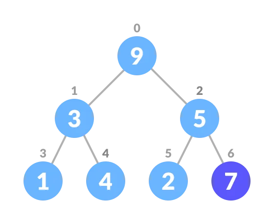
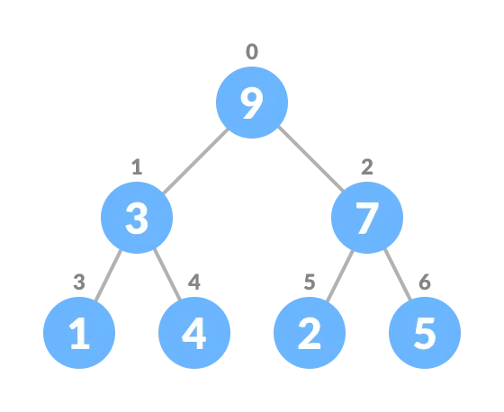
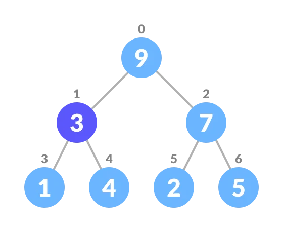
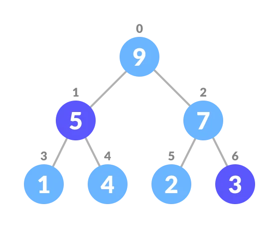
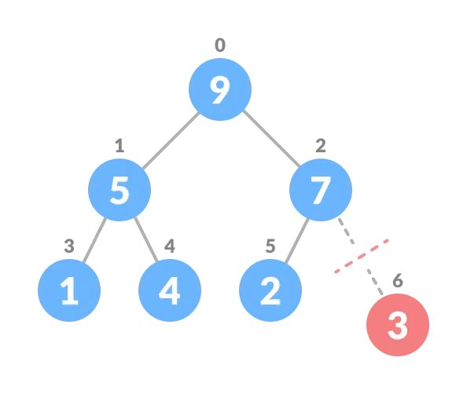
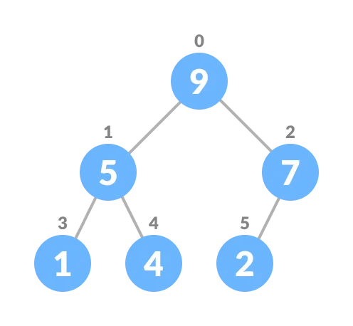

## Priority Queue

A priority queue is a special type of queue in which each element is associated with a priority value. And, elements are served on the basis of their priority. That is, higher priority elements are served first.

However, if elements with the same priority occur, they are served according to their order in the queue.

#### Assigning Priority Value

Generally, the value of the element itself is considered for assigning the priority. 

For example, The element with the highest value is considered the highest priority element. However, in other cases, we can assume the element with the lowest value as the highest priority element.

We can also set priorities according to our needs.

### Difference between Priority Queue and Normal Queue

In a queue, the FIFO rule is implemented whereas, in a priority queue, the values are removed on the basis of priority. The element with the highest priority is removed first.

### Implementation of Priority Queue

Priority queue can be implemented using an array, a linked list, a heap data structure, or a binary search tree. Among these data structures, heap data structure provides an efficient implementation of priority queues.

A comparative analysis of different implementations of priority queue is given below

<table>
    <tr>
        <td>Operations</td>
        <td>peek</td>
        <td>insert</td>
        <td>delete</td>
    </tr>
    <tr>
        <td>Linked List</td>
        <td>O(1)</td>
        <td>O(n)</td>
        <td>O(1)</td>
    </tr>
     <tr>
        <td>Binary Heap</td>
        <td>O(1)</td>
        <td>O(log n)</td>
        <td>O(log n)</td>
    </tr>
     <tr>
        <td>Binary Search Tree</td>
        <td>O(1)</td>
        <td>O(log n)</td>
        <td>O(log n)/td>
    </tr>
</table>

### Priority Queue Operations

Basis operations of a priority queue are inserting, removing, and peeking elements.

#### Inserting an Element into the Priority Queue

Inserting an element into a priority queue (max-heap) is don by the following steps.

- Insert the new element at the end of the tree.

- Heapify the tree.

<!-- Algorithm for insertion of an element into priority queue (max-heap) -->

#### Deleting an Element from the Priority Queue

Deleting an element from a priority queue (max-heap) is done as follows.

- Select the element to be deleted.

- Swap it with the last element.

- Remove the last element

- Heapify the tree

#### Peeking from the Priority Queue (Find max/min)

Peek operation returns the maximum element from Max Heap or minimum element from Min Heap without deleting the node.

For both Max heap and Min heap - return rootNode.

### Priority Queue Applications

Some of the applications of a priority queue are:

- Dijkstra's algorithm
- for implementing stack
- for load balancing and interrut handling in an operating system
- for data compression in Huffman code.

## References
URL : [https://www.programiz.com/dsa/priority-queue](https://www.programiz.com/dsa/priority-queue)
